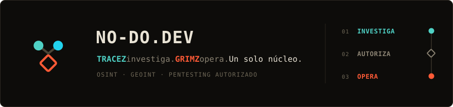

### La infraestructura común detrás de la investigación OSINT y las operaciones de pentesting autorizadas.

Somos **NO-DO**. Diseñamos, desplegamos y operamos [**no-do.dev**](https://no-do.dev): producto propio, en producción, sobre infraestructura propia. Sin intermediarios y sin datos de terceros en venta.

---

## Plataformas

| Consola | Qué resuelve | Estado |
| :--- | :--- | :--- |
| **[TRACEZ](https://tracez.no-do.dev)** `Fase 01 · Investigación` | Graph analytics y GEOINT multi-fuente en un solo workspace: entidades, transforms automatizados, geolocalización, timeline y panel en vivo (vuelos, sismos, clima, ISS) con imagen satelital NASA GIBS. | **Beta pública** |
| **[GRIMZ](https://grimz.no-do.dev)** `Fase 03 · Operación` | Superficie de ataque en tiempo real, escaneo `nmap` integrado, exploits priorizados por CVE e integración con Metasploit. Sin cambiar de pantalla. | **Enterprise** |
| **DEEPWIRE** `Fase 02 · El eslabón` | Une investigación y operación en una única consola, conservando la autorización explícita por objetivo y la trazabilidad completa. | **En construcción** |

## Autorización explícita, por diseño

Entre investigar y operar hay un paso que **no automatizamos**: el operador fija el alcance, activo por activo. Es explícito y humano por diseño, nunca automático. GRIMZ actúa únicamente sobre ese alcance autorizado y registra la evidencia de cada acción de punta a punta.

[Marco ético](https://no-do.dev/etica/) · [Términos](https://no-do.dev/terminos/) · [Privacidad](https://no-do.dev/privacidad/) · [Estado del servicio](https://no-do.dev/status/)

## Quién trabaja con esto

**Con TRACEZ** — periodistas de investigación reconstruyendo un caso, analistas de riesgo y OSINT independientes, equipos legales que necesitan trazabilidad de fuentes.

**Con GRIMZ** — pentesters autorizados que priorizan por CVE en vez de a ciegas, equipos red team con alcance definido y auditable, operadores de Metasploit que quieren una vista unificada.

## Base técnica

Cómputo en el edge, almacenamiento y autenticación compartidos entre ambas consolas.

`< 50 ms` latencia edge · `Zero-trust` en cada request · `0` datos en venta

## Equipo

[**eva420**](https://github.com/eva420) & [**Manuel-1312**](https://github.com/Manuel-1312), con un equipo de IA local como soporte de desarrollo.

El código de TRACEZ, GRIMZ y DEEPWIRE es propietario y vive en repositorios privados: producto en producción, no demos.

---

### ¿Hablamos?

**[→ no-do.dev](https://no-do.dev)** · [Abrir TRACEZ](https://tracez.no-do.dev) · [Abrir GRIMZ](https://grimz.no-do.dev) · [FAQ](https://no-do.dev/faq/) · [Sobre nosotros](https://no-do.dev/sobre-nosotros/)
