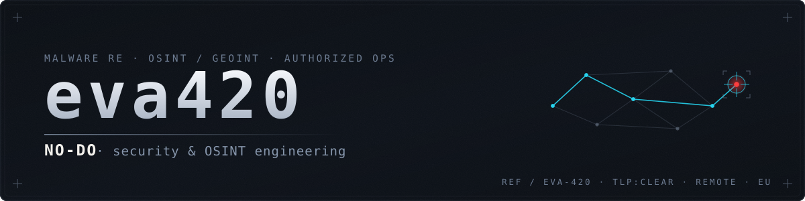

<!-- Banner: assets/banner.svg — single theme-invariant SVG committed under assets/. -->

  

`I reverse-engineer live threats, then build the OSINT / GEOINT and authorized-offensive tooling that answers them.`

Founder &amp; principal engineer · <a href="https://no-do.dev">NO-DO</a> &nbsp;·&nbsp; <em>Desmonto amenazas reales y construyo lo que las responde.</em>

  
  
  
  
  

## `whoami`

> **`eva420`** — the engineering home of [NO-DO](https://no-do.dev), a founder-led security & OSINT studio.
> One operator runs the whole chain: recon → authorized operation → infrastructure → signed evidence → edge deploy. Offensive and defensive, edge-native, authorization-first by construction.

---

## `SEC/01 · Public research`

[**`salat-stealer-analysis`**](https://github.com/eva420/salat-stealer-analysis) is an independent, end-to-end reverse-engineering of an **active Go-based Malware-as-a-Service infostealer** (*Salat Stealer / WebRat*, sold by Russian-speaking actors). Starting from a trojanized "gamer tools" pack, I reversed the `garble`-obfuscated Go loader in **Ghidra (headless)**, extracted and decrypted its self-embedded payload — **ChaCha20-Poly1305 + zstd**, CBOR-chunked — to recover a 12.5 MB PE32 stealer, detonated it in an **isolated lab**, and pulled the live C2 straight off the **TLS ClientHello SNI** after the sample hid resolution behind DNS-over-HTTPS. A purely **passive urlscan.io pivot by IP** then expanded the 5 documented C2 domains to **12 domains plus a live admin panel** whose origin was exposed by an operator OPSEC failure. Attribution is kept **group-level and sanitized** — no victim data, no named individuals — and the write-up ships a full IOC table with a machine-readable [`iocs.csv`](https://github.com/eva420/salat-stealer-analysis/blob/main/iocs.csv). This is the "verify me in two clicks" anchor for everything below: all technique- and infrastructure-level, reproducible from the page itself.

 &nbsp; **Read the full write-up →** [`eva420/salat-stealer-analysis`](https://github.com/eva420/salat-stealer-analysis)

## `SEC/02 · Capabilities`

A deliberately thin public surface, mapped to the work that proves each discipline. Most rows point at something checkable — a public repo or a live product — with no private code exposed.

| Discipline | Where it's proven |
|---|---|
| Malware RE & threat intelligence | **[salat-stealer-analysis](https://github.com/eva420/salat-stealer-analysis)** — Ghidra RE, payload decryption, live C2 discovery, published IOCs *(public)* |
| OSINT / GEOINT | **[TRACEZ](https://tracez.no-do.dev)** — entity graphs, geolocation & timeline, live Earth data *(in production)* |
| Authorized offensive security | **[GRIMZ](https://grimz.no-do.dev)** — scope-bound pentest tooling, live billing *(in production)* |
| Recon → operation fusion | **[DEEPWIRE](https://no-do.dev/en/deepwire/)** — managed engagements, recon into authorized operation *(in production)* |
| Edge infrastructure & applied crypto | Cloudflare Workers + D1; Ed25519 node-locked licensing & signed evidence — applied crypto shown publicly in the [salat payload decryption](https://github.com/eva420/salat-stealer-analysis) (ChaCha20-Poly1305) |

## `SEC/03 · In production`

Research turned into tooling — shipped, live, and (where it applies) monetized. Each is verifiable from its own URL; none requires access to a private repo.

| Product | What it is | Status |
|---|---|---|
| **[TRACEZ](https://tracez.no-do.dev)** | OSINT/GEOINT graph console: entities, relationships, geolocation and timeline, plus live Earth data (flights, earthquakes, weather, ISS, NASA imagery) and AI case auto-expansion — one investigation workspace on Cloudflare Workers + D1. |  |
| **[GRIMZ](https://grimz.no-do.dev)** | Authorized-pentest product: deny-by-default scope enforcement, node-locked licensing, enterprise engagements and controlled-intrusion training labs. |  |
| **[DEEPWIRE](https://no-do.dev/en/deepwire/)** | Managed engagements that fuse recon (TRACEZ-class intelligence) into authorized operation (GRIMZ-class execution) as a single, accountable flow. |  |

## `SEC/04 · Rules of engagement`

Ethics here is an engineering property, not a disclaimer. The controls are the argument:

- **Authorization-first.** Offensive capability is gated on written scope and rules of engagement — enforced in code. GRIMZ ships **deny-by-default scope**: out-of-scope targets are refused by construction, not by convention.
- **Scope-bound by construction.** Licensing is **node-locked (Ed25519)** — tooling runs where it is authorized to run, and nowhere else.
- **Evidence you can verify.** Deliverables are **Ed25519-signed**, so a third party can check integrity and origin without having to trust me.
- **Defender-focused.** Public research ships at **TLP:CLEAR** with IOCs for blue teams; attribution stays group-level; labs are isolated and disposable.
- **No rented offensive access.** NO-DO deliberately does not sell hosted offensive capability — a liability line held on purpose, not a missing feature.

Coordinated disclosure & full policy: [`SECURITY.md`](./SECURITY.md) · [contacto@no-do.dev](mailto:contacto@no-do.dev)

## `SEC/05 · Stack`

TypeScript (strict) end to end · Python for tooling and analysis · Go for reverse-engineering and binary internals · Cloudflare Workers + D1 at the edge · Ed25519 for node-locked licensing and signed evidence · Ghidra and `tshark` for reverse-engineering · a **local** LLM for analysis, so investigation data never leaves the box.

  
  
  
  
  
  
  

## `SEC/06 · Engage`

**Authorized security & OSINT engagements, research collaboration, or hiring** — one inbox, one site, no link tree.

- **Email** — [contacto@no-do.dev](mailto:contacto@no-do.dev)
- **Web** — [no-do.dev](https://no-do.dev)
<!-- SOCIAL: once the accounts exist, add exactly two links here — LinkedIn (recruiter path) + one infosec presence (X or infosec.exchange). Keep to two, max. -->

Open to collaboration and select security roles. · Abierto a colaboración y a proyectos seleccionados.

---

<!-- STATS: intentionally none. At 0 stars / 0 followers, stat-card / streak / trophy / snake widgets advertise the weakness rather than hide it. Do not add them. -->

  <code>+ &nbsp; eva420 · NO-DO · recon → operation → signed evidence · Remote · EU</code>

